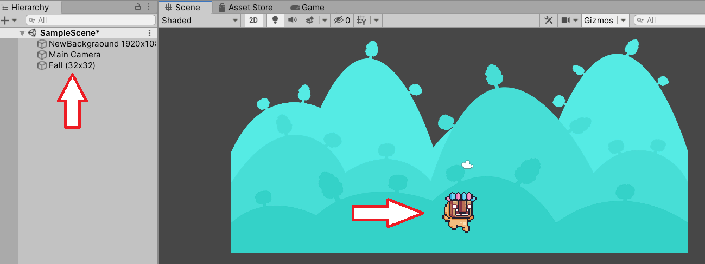
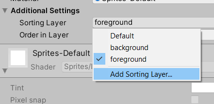
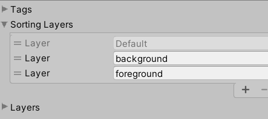

# Adding to Scene

  <button class="tablinks active" onclick="openTab(event, 'Overview')">Adding</button>
  <button class="tablinks" onclick="openTab(event, 'Sorting')">Sorting Layers</button>
  <button class="tablinks" onclick="openTab(event, 'ToDo')">To Do</button>

This is the best part!  Choose assets from the <b>Project</b> window and drag the into the <b>Scene</b> window.  Then, move the asset around to look the way you want them to.

Remember, as you add assets, you may want some assets to be above another.  That is where Sorting Layers come in.  You can assign a layer to an object after you create a custom layer.

You can also set the order of the layers.

  
Add two or more objects and put them on different layers.  Why would you do that?

  

