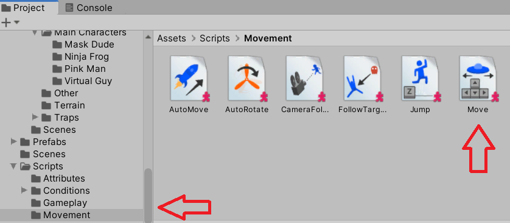
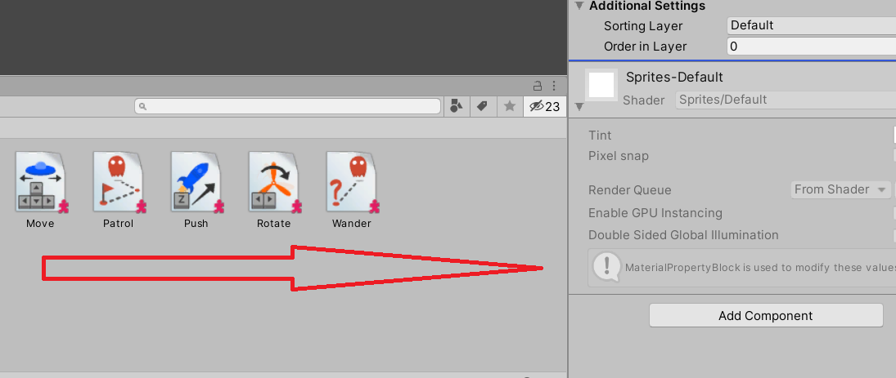
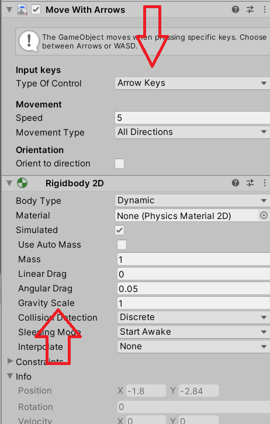
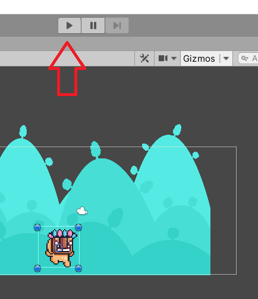

# Adding Scripts to Project

<div class="tab">
  <button class="tablinks active" onclick="openTab(event, 'Overview')">Adding</button>
  <button class="tablinks" onclick="openTab(event, 'Project')">Project Window</button>
<button class="tablinks" onclick="openTab(event, 'Component')">Script as a Component</button>
<button class="tablinks" onclick="openTab(event, 'Custom')">Custom Script</button>
<button class="tablinks" onclick="openTab(event, 'ToDo')">To Do</button>

</div>

<div id="Overview" class="tabcontent" style="display:block">

<p>If we use existing scripts, we can design a game with custom assets.  This gives us the ability to create prototypes and create proof of concepts before diving into the customization of game programming.  It also allows game designers to focus on what is most important to them - game play.</p>

<p>If you want to move scripts over from your Playground project, copy the <b>Scripts</b> and the <b><i>_INTERNAL_</i></b> folder into your <b>Assets</b> folder.  Then, you will need to change the following in the code.</p>

<div style="background-color:blue;color:white">
  [AddComponentMenu("[name of Playground project]/Movement/Auto Move")]
</div>
to
<div style="background-color:blue;color:white">
[AddComponentMenu("[new project]/Movement/Auto Move")]
</div>

</div>
<div id="Project" class="tabcontent">

<p>In the <b>Project</b> window, you will find the movement scripts.</p>

<p></p>

<p>After this script is found, then you want to drag the script into the <b>Inspector</b> window to add it to the object.</p>

<p></p>

</div>
<div id="Component" class="tabcontent">

<p>Notice that after the script is added as a component, it adds not only the script, but also the <b>RigidBody2D</b> which is what allows the object to interact in the scene.</p>

<p>Don't forget to adjust the gravity so the object doesn't fall straight down.</p>

<p></p>

<p>Finally, press play to see how the script and the object work together.</p>

<p></p>
</div>

<div id="Custom" class="tabcontent">
<div class="tabhtml" markdown="1">

  What are the main methods

  ```csharp
using UnityEngine;
using System.Collections;

public class MainPlayer : MonoBehaviour {

    // Use this for initialization
    void Start () {
    
    }
    
    // Update is called once per frame
    void Update () {
    
    }
}
```

Where does this show up?

```csharp

// Use this for initialization
void Start () 
{
    Debug.Log("I am alive!");
}

```

What about variables?

```csharp
using UnityEngine;
using System.Collections;

public class MainPlayer : MonoBehaviour 
{
    public string myName;
    
    // Use this for initialization
    void Start () 
    {
        Debug.Log("I am alive and my name is " + myName);
    }
}
```

Finding components

```csharp
void Start () 
{
    Rigidbody2D rb = GetComponent<Rigidbody2D>();
}
```

```csharp
void Start () 
{
    Rigidbody2D rb = GetComponent<Rigidbody2D>();
    
    // Change the mass of the object's Rigidbody.
    rb.mass = 10f;
}
```

what about making it move?

```csharp
void Start ()
{
    Rigidbody2D rb = GetComponent<Rigidbody2D>();
    
    // Add a force to the Rigidbody.
    rb.AddForce(Vector2.up * 10f);
}
```

What if I need to find a specific object? I can access by tag or name

```csharp
GameObject player;

void Start() 
{
    player = GameObject.Find("MainHeroCharacter");
}
```

Let's add a custom script to make our objects move

  ```csharp

     public float speed;                //Floating point variable to store the player's movement speed.

    private Rigidbody2D rb2d;        //Store a reference to the Rigidbody2D component required to use 2D Physics.

    // Use this for initialization
    void Start()
    {
        //Get and store a reference to the Rigidbody2D component so that we can access it.
        rb2d = GetComponent<Rigidbody2D> ();
    }

    //FixedUpdate is called at a fixed interval and is independent of frame rate. Put physics code here.
    void FixedUpdate()
    {
        //Store the current horizontal input in the float moveHorizontal.
        float moveHorizontal = Input.GetAxis ("Horizontal");

        //Store the current vertical input in the float moveVertical.
        float moveVertical = Input.GetAxis ("Vertical");

        //Use the two store floats to create a new Vector2 variable movement.
        Vector2 movement = new Vector2 (moveHorizontal, moveVertical);

        //Call the AddForce function of our Rigidbody2D rb2d supplying movement multiplied by speed to move our player.
        rb2d.AddForce (movement * speed);
    }
  ```

  Update functions


A game is rather like an animation where the animation frames are generated on the fly. A key concept in games programming is that of making changes to position, state and behavior of objects in the game just before each frame is rendered. The Update function is the main place for this kind of code in Unity. Update is called before the frame is rendered and also before animations are calculated.

```csharp
void Update() {
    float distance = speed * Time.deltaTime * Input.GetAxis("Horizontal");
    transform.Translate(Vector2.right * distance);
}

```

The physics engine also updates in discrete time steps in a similar way to the frame rendering. A separate event function called FixedUpdate is called just before each physics update. Since the physics updates and frame updates do not occur with the same frequency, you will get more accurate results from physics code if you place it in the FixedUpdate function rather than Update.

```csharp
void FixedUpdate() {
    Vector2 force = transform.forward * driveForce * Input.GetAxis("Vertical");
    rigidbody.AddForce(force);
}
```

#### Start

It is often useful to be able to call initialization code in advance of any updates that occur during gameplay. The Start function is called before the first frame or physics update on an object. The Awake function is called for each object in the scene at the time when the scene loads. Note that although the various objects’ Start and Awake functions are called in arbitrary order, all the Awakes will have finished before the first Start is called. This means that code in a Start function can make use of other initializations previously carried out in the Awake phase.

#### Collisions 

The physics engine will report collisions against an object by calling event functions on that object’s script. The OnCollisionEnter, OnCollisionStay and OnCollisionExit functions will be called as contact is made, held and broken. The corresponding OnTriggerEnter, OnTriggerStay and OnTriggerExit functions will be called when the object’s collider
is configured as a Trigger (ie, a collider that simply detects when something enters it rather than reacting physically). These functions may be called several times in succession if more than one contact is detected during the physics update and so a parameter is passed to the function giving details of the collision (position, identity of the incoming object, etc).


</div>
</div>

<div id="ToDo" class="tabcontent">
<div class="tabhtml" markdown="1">
   1. Take 2 minutes and discuss why the AddComponentMenu had to be changed.
   2. Take 2 minutes and discuss with a classmate what the FixedUpdate is and how it differs from Update.
   3. Take 2 minutes and discuss what the GetAxis is.
   4. Take 2 minutes and discuss what the AddForce does
   5. How do you make the object flip when it changes direction?
   6. Share what you came up and show your results.
   </div>
</div>

